### README

<div align="center">
  <br />
  <a href="https://drive.google.com/file/d/1Z1pye1fhJ54k1q9vDA83xoFwrNhy6eBO/view?usp=sharing"> 
    
  </a>
  <br />
    <a href="https://drive.google.com/file/d/1Z1pye1fhJ54k1q9vDA83xoFwrNhy6eBO/view?usp=sharing"> 
    
  </a>
</div>
<div align="center">
 <h3><b>Trinity</b></h3>
 의지할 곳 없는 광활한 우주에서 우주 기생충으로 인해 격리된 3명의 우주 비행사  <br>
 치사율 100% 우주 기생충! 마주치면 죽는다..!!<br>
 기지에 도착하여 치료제를 얻을 때까지 협동하여 살아남아라!<br>
 협동 생존 게임<br>
 <br> 
  삼성 청년 SW 아카데미</b><br>
  <br>
  2023.10.09 ~ 2023.11.17
  <br>
  <a href="https://youtu.be/Ek6_Gn8dyKw"> 
    <br>
    UCC 보러가기
  </a>

  <br>

  <a href="https://drive.google.com/file/d/1Z1pye1fhJ54k1q9vDA83xoFwrNhy6eBO/view?usp=sharing"> 
    <br>
    다운로드
  </a>
</div>

# 👨‍👩‍👧‍👦 멤버

<div align="middle">
<table>
    <tr>
        <td height="140px" align="center"> <a href="https://github.com/junyoung449">
            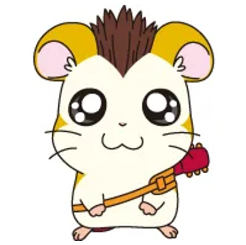 <br><br> 🤬 허준영 <br>(Client) </a> <br></td>
        <td height="140px" align="center"> <a href="https://github.com/pockypepe">
            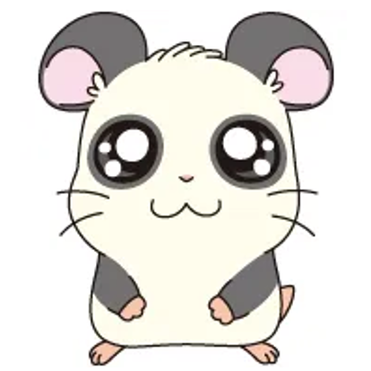 <br><br> 🩷 송혁준 <br>(Server) </a> <br></td>
        <td height="140px" align="center"> <a href="https://github.com/CodingOnionFarmer">
            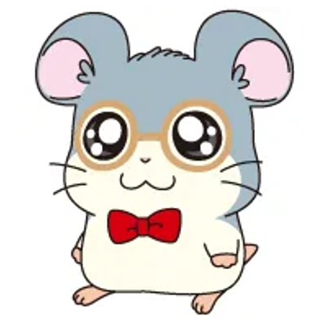 <br><br> 🍁 정내혁 <br>(Client) </a> <br></td>
        <td height="140px" align="center"> <a href="https://github.com/kingofthigh">
            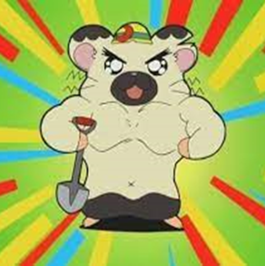 <br><br> 💪🏻 정의민 <br>(Server) </a> <br></td>
        <td height="140px" align="center"> <a href="https://github.com/YEONGINJOO">
            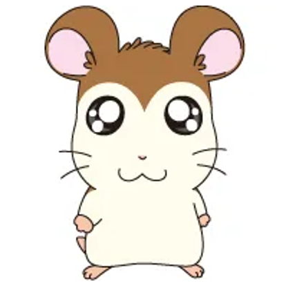 <br><br> 🤖 주영인 <br>(Client) </a> <br></td>
        <td height="140px" align="center"> <a href="https://github.com/ZIM-H">
            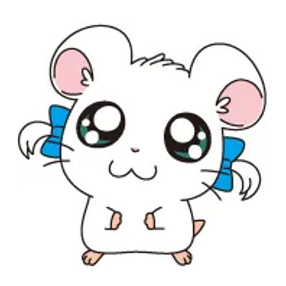 <br><br> 🧚🏻 홍지민 <br>(Server) </a> <br></td>
    </tr>
</table>
</div>
<br>

# ⚙️ 아키텍쳐 및 기술 소개

<div align=left>
<table>
    <tr>
        <td><b>Server</b></td>
        <td>
            
            
            
            
        </td>
    </tr>
    <tr>
        <td><b>Client</b></td>
        <td>
            
            
            
            
        </td>
    </tr>
    <tr>
        <td><b>Infra</b></td>
        <td>
            
            
            
            
            
        </td>
    </tr>
    <tr>
        <td><b>VC</b></td>
        <td>
            
            
            <a href="https://www.figma.com/file/KObkmkOWMarSul47fAAYC0/B108?type=design&node-id=0-1&mode=design">
              
            </a>
            <br> 
        </td>
    </tr>
    <tr>
        <td><b>Tools</b></td>
        <td>
            
            
            <a href="https://rustic-aphid-716.notion.site/PJT-B308-c390cf2bd09d469a862016cd502e2c85?pvs=4">
            </a>
        </td>
    </tr>
</table>
</div>

<br>

# 🪓 시스템 아키텍처

## Trinity

  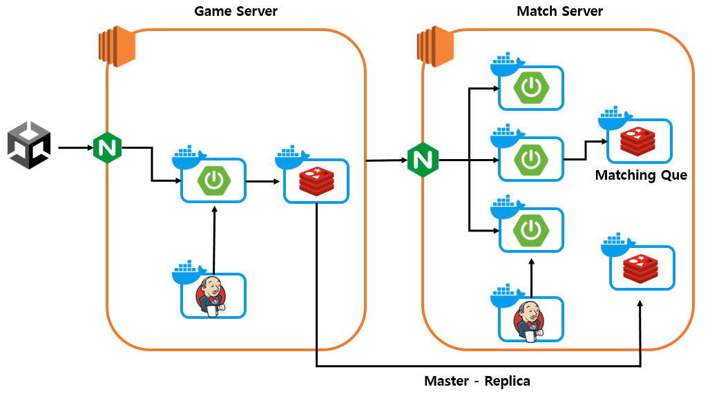

# 🆘 프로젝트 구조

### Client

```
─Adaptive Performance
│  ├─Provider
│  └─Settings
├─Asteroids pack
│  ├─Materials
│  ├─Meshes
│  ├─Prefabs
│  ├─Scenes
│  └─Textures
│      ├─Texture 1
│      ├─Texture 2
│      ├─Texture 3
│      ├─Texture 4
│      └─Texture 5
├─BlitzRig
│  ├─Editor
│  └─Script
├─Editor
│  └─com.unity.mobile.notifications
├─FantasyHavenAssets
│  └─AlienBug
│      ├─AnimationClips
│      ├─Modell
│      ├─_Animator
│      ├─_Material
│      └─_Prefabs
├─FPS Control Unity Mobile
├─Furniture_FREE
│  ├─Materials
│  ├─Meshes
│  ├─Prefabs
│  ├─Scenes
│  └─Textures
├─Image Joystick _ Render Texture
├─Images
├─Layer Lab
│  ├─GUI Kit - Mono Round
│  │  ├─Prefabs
│  │  │  └─Prefabs_DemoScene
│  │  └─ResourceData
│  │      ├─Fonts
│  │      └─Sprites
│  │          └─Components
│  │              ├─Button
│  │              └─Popup
│  └─GUI PRO Kit - Simple Casual.PSD Sources
│      ├─Prefabs
│      │  ├─Prefabs_Component_Popups
│      │  ├─Prefabs_Component_Sliders
│      │  └─Prefabs_DemoScene_Panels
│      │      └─Dark
│      ├─ResourcesData
│      │  ├─Fonts
│      │  └─Sprites
│      │      ├─Components
│      │      │  ├─Button
│      │      │  │  ├─Button_Custom
│      │      │  │  ├─Button_Demo_Common
│      │      │  │  ├─Button_Demo_Dark
│      │      │  │  └─Button_Demo_Light
│      │      │  ├─Frame
│      │      │  │  ├─Frame_Demo_Common
│      │      │  │  └─Frame_Demo_Dark
│      │      │  ├─Popup
│      │      │  │  ├─Popup_Custom
│      │      │  │  ├─Popup_Demo_Common
│      │      │  │  ├─Popup_Demo_Dark
│      │      │  │  └─Popup_Demo_Light
│      │      │  └─Slider
│      │      │      ├─Slider_Demo_Common
│      │      │      ├─Slider_Demo_Dark
│      │      │      └─Slider_Demo_Light
│      │      └─Demo
│      │          ├─Demo_Character
│      │          ├─Demo_Icon
│      │          ├─Demo_Image
│      │          └─Demo_Play
│      └─Scripts
├─Megapoly.Art
│  └─Vintage Controls
│      ├─Materials
│      ├─Meshes
│      ├─Prefabs
│      ├─Scenes
│      ├─Scripts
│      └─Textures
├─Music
├─OutlineEffect
│  ├─OutlineEffect
│  │  └─Resources
│  └─Samples
│      └─Demo
│          └─Content
│              └─chair
├─OutlineToolkit
│  ├─Script
│  └─Shader
├─Plugins
│  ├─Android
│  └─Demigiant
│      └─DOTween
│          ├─Editor
│          │  └─Imgs
│          └─Modules
├─Resources
│  └─InteractiveUI
│      └─RenderTexture
├─Scenes
│  └─New Folder
├─Scripts
│  ├─MainScreen
│  ├─ResponseData
│  └─VariableManager
├─SimpleSpaceInteriors
│  ├─Materials
│  ├─Models
│  ├─Prefabs
│  │  ├─Environments
│  │  ├─Items
│  │  └─Props
│  ├─Scenes
│  └─Textures
├─TextMesh Pro
│  ├─Documentation
│  ├─Examples & Extras
│  │  ├─Prefabs
│  │  └─Scripts
│  ├─Fonts
│  ├─Resources
│  │  ├─Fonts & Materials
│  │  ├─Sprite Assets
│  │  └─Style Sheets
│  ├─Shaders
│  └─Sprites
├─TrinityShip
│  └─Materials
├─TutorialInfo
│  ├─Icons
│  └─Scripts
│      └─Editor
├─WarZone Sci-Fi Turret pack
│  └─Materials
├─WebSocket
└─Work
```

### Client Web Site

```
│  .gitignore
│  Dockerfile
│  Jenkinsfile
│  package-lock.json
│  package.json
│  README.md
│  tsconfig.json
│  yarn.lock
│
├─public
│  │  favicon.ico
│  │  favicon_trinity.png
│  │  index.html
│  │  logo192.png
│  │  logo512.png
│  │  manifest.json
│  │  robots.txt
│  │
│  └─assets
│          Biryo.png
│          ctrl.png
│          FirstRoom.png
│          medi.png
│          medi_ui.PNG
│          SecondRoom.png
│          spaceship_colored_joint.fbx
│          ThirdRoom.png
│          Trinity_Biryoroom_UI.PNG
│          Trinity_ctrlroom_ui.PNG
│          Trinity_logo.png
│          Trinity_memo.PNG
│          Trinity_memo_1.PNG
│          UI.png
│
└─src
    │  App.css
    │  App.test.tsx
    │  App.tsx
    │  globalstyles.tsx
    │  index.css
    │  index.tsx
    │  logo.svg
    │  react-app-env.d.ts
    │  reportWebVitals.ts
    │  setupTests.ts
    │
    ├─assets
    │      backgroundgifimg.gif
    │      doctor.png
    │      energy-drink.png
    │      farmer.png
    │      fertilizer.png
    │      potatoes.png
    │      Scene.tsx
    │      security.png
    │      spaceship.gltf
    │      spaceship_colored_joint.fbx
    │      trinitylogo.png
    │
    ├─components
    │      3dmodelviewer.tsx
    │      neonbtn.tsx
    │
    ├─fonts
    │      PFstardust.ttf
    │
    └─pages
        │  biryoroom.tsx
        │  controlroom.tsx
        │  gameintro.tsx
        │  gamerule.tsx
        │  mainhome.tsx
        │  medicineroom.tsx
        │  privatepolicy.tsx
        │
        └─account
                findpassword.tsx
                locallogin.tsx
                login.tsx
                mypage.tsx
                signup.tsx
                sociallogin.tsx
                socialsignup.tsx
```

### Game Server

```
├─java
│  └─com
│      └─trinity
│          └─trinity
│              │  TrinityApplication.java
│              │
│              ├─domain
│              │  ├─control
│              │  │  ├─api
│              │  │  │      GameConnectController.java
│              │  │  │
│              │  │  ├─dto
│              │  │  │  │  PlayerDto.java
│              │  │  │  │
│              │  │  │  ├─request
│              │  │  │  │      FirstRoomPlayerRequestDto.java
│              │  │  │  │      SecondRoomPlayerRequestDto.java
│              │  │  │  │      ThirdRoomPlayerRequestDto.java
│              │  │  │  │
│              │  │  │  └─response
│              │  │  │          CommonDataDto.java
│              │  │  │          FirstRoomPlayerResponseDto.java
│              │  │  │          FirstRoomResponseDto.java
│              │  │  │          GameOverDto.java
│              │  │  │          SecondRoomResponseDto.java
│              │  │  │          ThirdRoomResponseDto.java
│              │  │  │
│              │  │  ├─enums
│              │  │  │      UserStatus.java
│              │  │  │
│              │  │  └─service
│              │  │          GameConnectService.java
│              │  │          GameConnectServiceImpl.java
│              │  │
│              │  └─logic
│              │      ├─dto
│              │      │      Events.java
│              │      │      FirstRoom.java
│              │      │      GameRoom.java
│              │      │      GameRoomCheck.java
│              │      │      Round.java
│              │      │      SecondRoom.java
│              │      │      ThirdRoom.java
│              │      │
│              │      └─service
│              │              CreateService.java
│              │              GameRoomService.java
│              │              GameRoomServiceImpl.java
│              │
│              └─global
│                  ├─dto
│                  │      ClientSession.java
│                  │      ClientUserId.java
│                  │
│                  ├─redis
│                  │  ├─config
│                  │  │      RedisConfig.java
│                  │  │
│                  │  └─service
│                  │          GameRoomRedisService.java
│                  │          RedisService.java
│                  │
│                  ├─webClient
│                  │  ├─config
│                  │  │      WebClientConfig.java
│                  │  │      WebClientProperties.java
│                  │  │
│                  │  └─service
│                  │          WebClientService.java
│                  │
│                  └─webSocket
│                          ChannelManager.java
│                          WebSocketFrameHandler.java
│                          WebSocketServer.java
│                          WebSocketServerInitializer.java
│
└─resources
        application.yml
```

### match Server

```
├─java
│  └─com
│      └─trinity
│          └─match
│              │  MatchApplication.java
│              │
│              ├─domain
│              │  └─matchQ
│              │      ├─api
│              │      │      MatchQController.java
│              │      │      MatchQSwaggerController.java
│              │      │
│              │      ├─dto
│              │      │  └─request
│              │      │          GameServerPlayerListRequestDto.java
│              │      │
│              │      └─service
│              │              MatchQService.java
│              │              MatchQServiceImpl.java
│              │
│              └─global
│                  ├─redis
│                  │  ├─config
│                  │  │      GameRedisConfig.java
│                  │  │      MatchRedisConfig.java
│                  │  │      RedisProperties.java
│                  │  │      RedissonConfig.java
│                  │  │
│                  │  └─service
│                  │          RedisService.java
│                  │          RedisServiceImpl.java
│                  │
│                  └─webClient
│                          WebClientConfig.java
│                          WebClientProperties.java
│                          WebClientService.java
│
└─resources
        application.yml
```

# 📚 Redis 데이터 저장 구조

## Game Server

<br>

### gameRoomCheck Hash

<br>
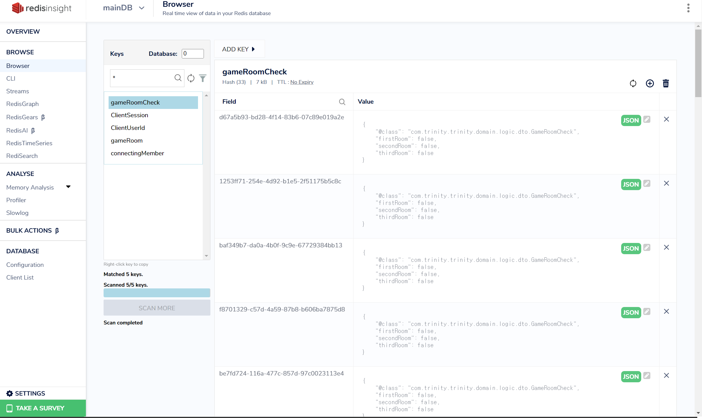<br>

### temp Hash

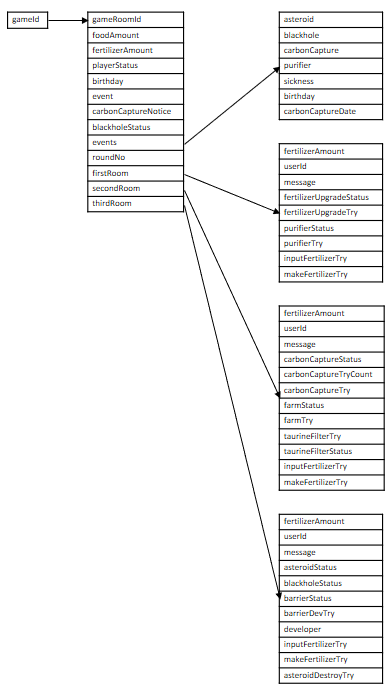<br>
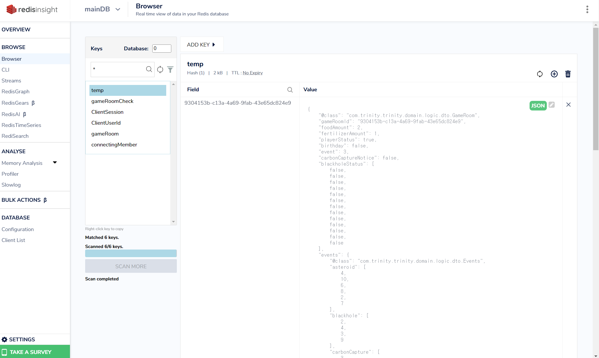<br>

### ClientSession Hash

<br>
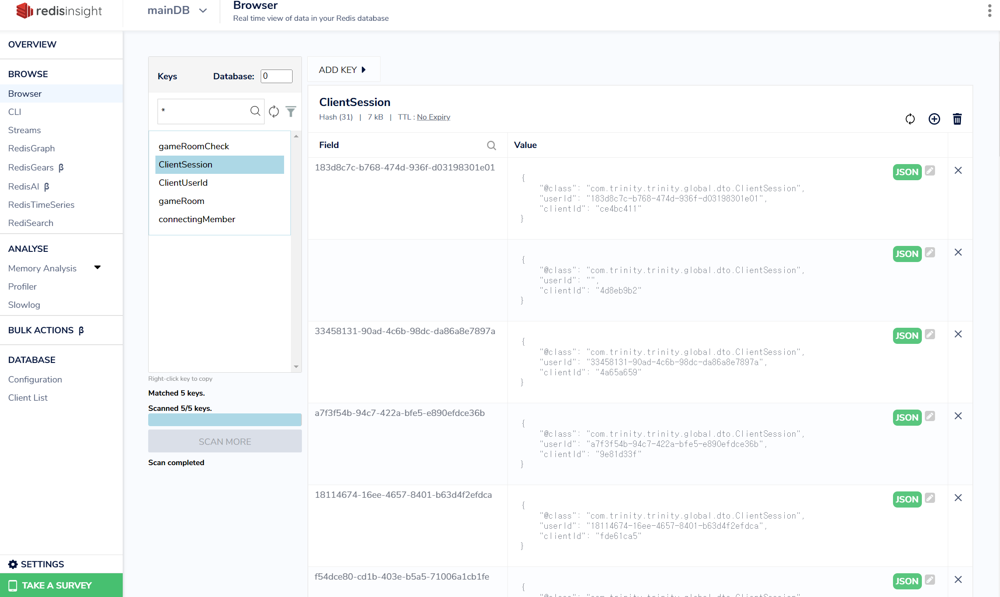<br>

### ClientUserId Hash

<br>
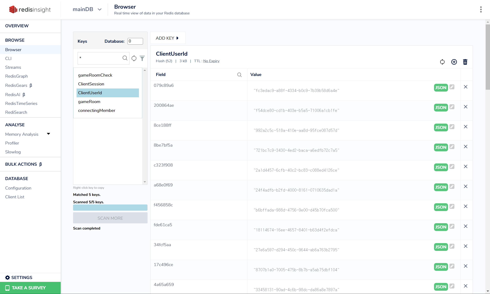<br>

### gameRoom Hash

<br>
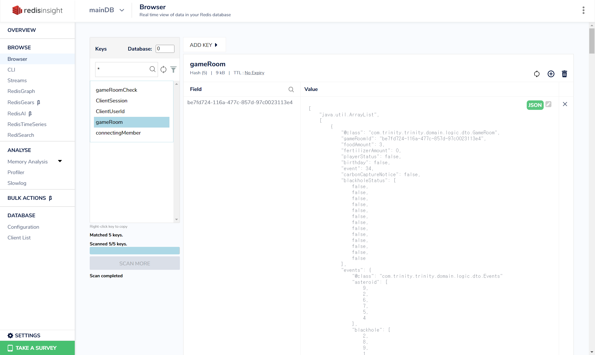<br>

### connectingMember Hash

<br>
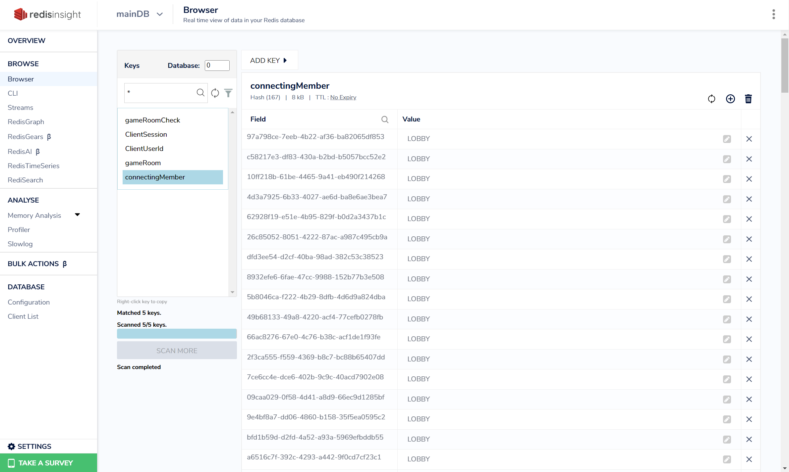<br>

## Match Server

## matchQ ZSet

<br>
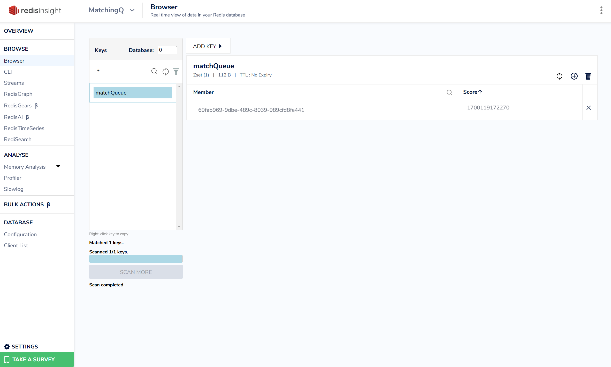<br>

# 🎮 게임 소개

## 튜토리얼

<p float="left">
  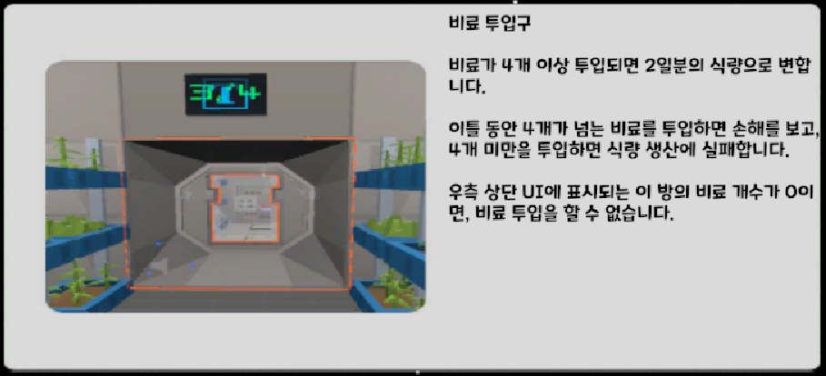
  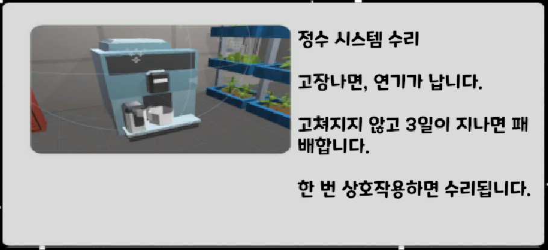 
  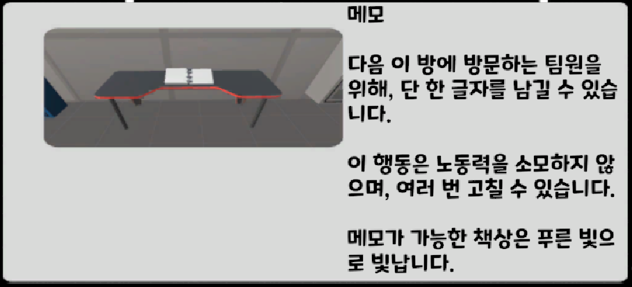
</p>

<p float="left">
  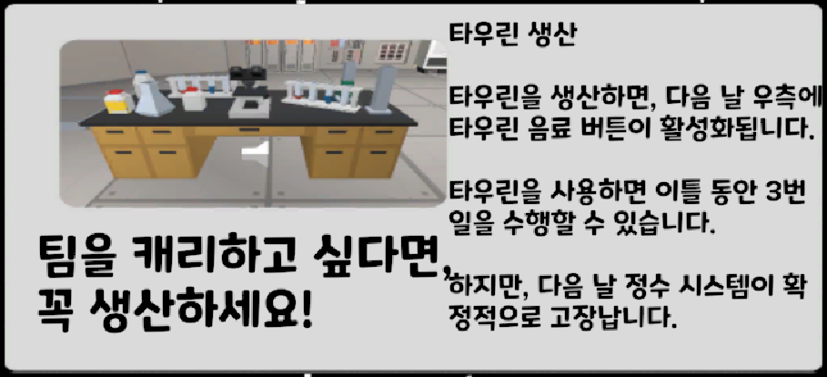
  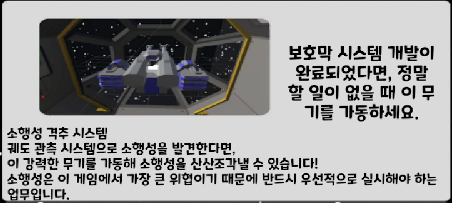 
  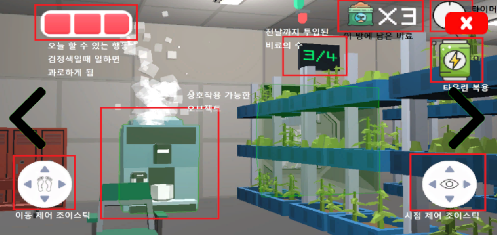
</p>

- 메인 화면에서 `tutorial` 버튼을 클릭하면 게임의 상세 정보를 확인할 수 있습니다.

## 게임 시작

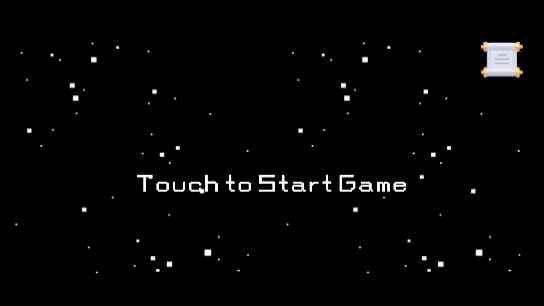<br>

<br>

### 로그인

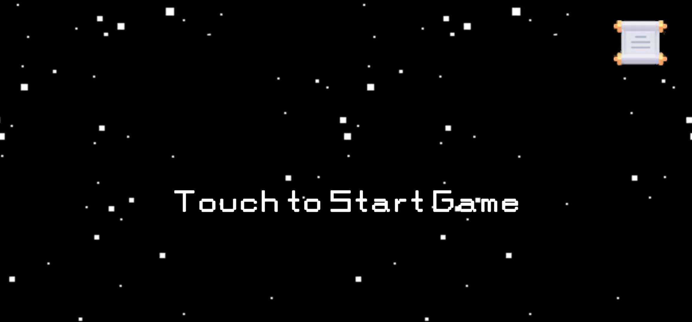<br>

- 랜덤 UUID를 발급해 로그인합니다.

<br>

### 게임 찾기

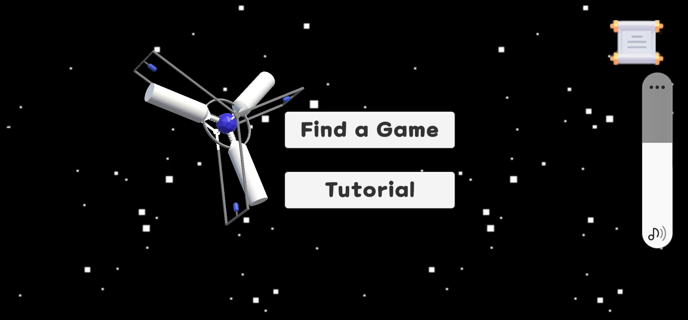<br>

- `find a game` 버튼을 눌러 게임 접속 시도를 합니다.

### 게임 시작

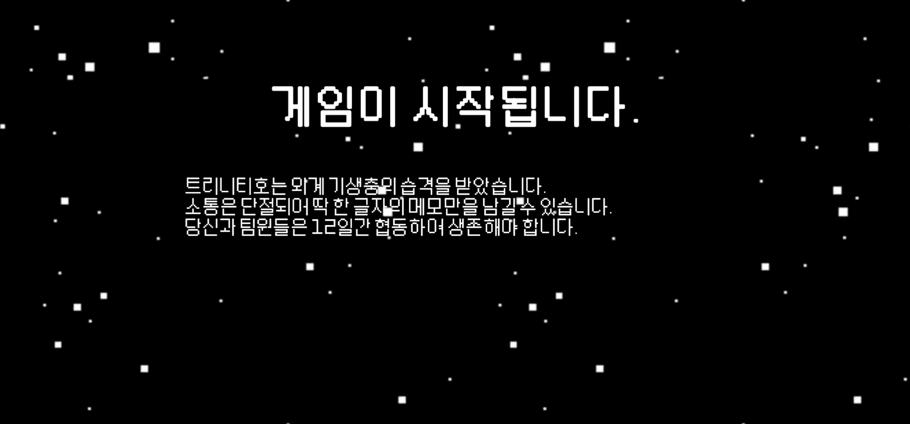<br>

## 공통 작업

- 모든 방에서 다음과 같은 일을 할 수 있습니다.

### 비료 투입

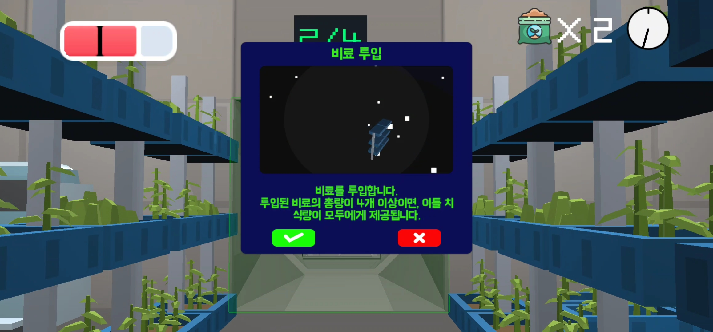<br>

- 방에 있는 비료의 개수가 1 이상일때만 비료를 중앙 정원에 넣을 수 있습니다.
- 중앙 정원에 투입된 비료의 개수가 4개 이상일때 식량이 2개 생산됩니다.
- 비료의 양이 4개를 초과해도 생산되는 식량의 개수는 2개로 동일합니다. <br>
  (협동하여 비료를 낭비하지 마세요.)
- 소행성과 충돌하면 저장된 비료가 0으로 초기화됩니다.

### 비료 생산

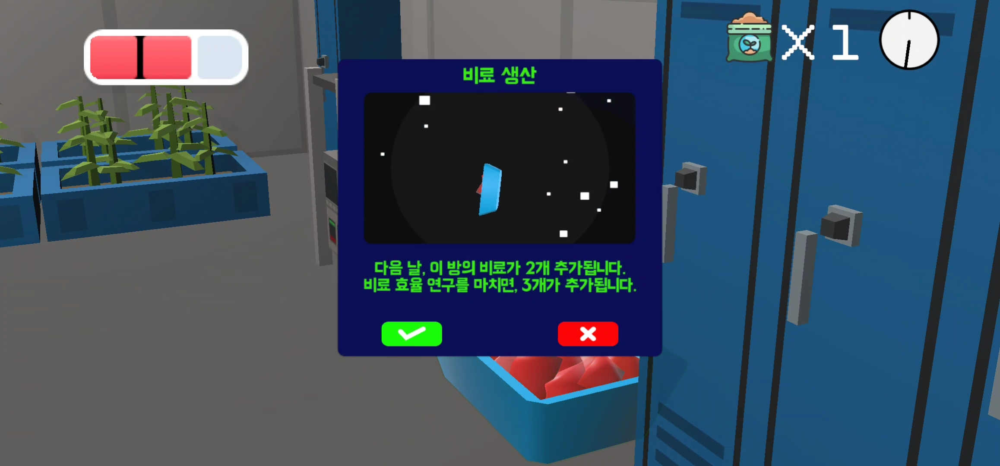<br>

- 비료를 2개 생산합니다.
- 비료 개발 연구를 완료했다면 비료를 3개 생산합니다.

### 메모 남기기

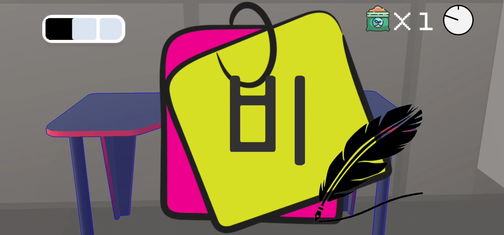<br>

- 메모를 남겨 다음 팀원에게 메시지를 전달할 수 있습니다.
- 단, 한 글자만 남길 수 있다
- 노동력을 소모하지 않습니다.
- 최대한 많이 활용하여 팀원들과 소통하세요.
  <br>

## 1️⃣일차 - 관측실

<br>
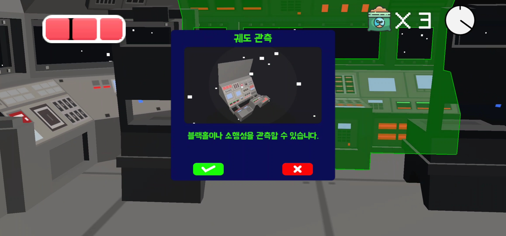<br>

- 관측실에서는 다음과 같은 일을 할 수 있습니다.

1. 소행성 또는 블랙홀 관측
   - 소행성 또는 블랙홀을 관측할 수 있습니다.
   - 소행성 발견 시 소행성 파괴를 할 수 있습니다.
2. 소행성 파괴
   - 소행성 관측을 해야만 파괴할 수 있습니다.
   - 소행성을 파괴하지 않으면 중앙 정원이 고장나 식량 생산에 불이익을 받습니다.
   - 소행성과 출돌하면 현재까지 넣어둔 비료의 양이 0으로 변합니다.
3. 보호막 연구
   - 같은 사람이 연구를 2번해야 완성됩니다.
   - 중간에 다른 사람이 연구를 하면 연구 횟수가 초기화됩니다.
   - 보호막이 연구가 완료되면 소행성을 파괴하지 않아도 중앙 정원이 고장나지 않습니다.

<br>

## 2️⃣일차 - 재배 연구실

<br>

- 재배 연구실에서는 다음과 같은 일을 할 수 있습니다.

1. 비료 개발 연구
   - 비료 개발 연구는 누구든지 연구할 수 있습니다.
   - 비료 개발 연구를 2회하면 연구가 완료됩니다.
   - 비료 개발 연구가 완료되면, 비료 생산 시 3개씩 생산됩니다.
2. 정수 시스템 수리 (고장 시)
   - 타우린 정제를 하거나 랜덤(이벤트)으로 고장납니다.
   - 1일 수리하면 고칠 수 있습니다.
   - 수리하지 않고 2일이 지나면 정수(깨끗한 물) 부족으로 패배합니다.

  <br>

## 3️⃣일차 - 약제실

<br>

- 약제실에서는 다음과 같은 상호작용을 할 수 있습니다.

1.  타우린 정제
    - 타우린 정제를 하면 재배 연구실의 정수 시스템이 고장납니다.
    - 타우린은 다음날부터 사용이 가능합니다.
    - 타우린을 사용하면 2일 동안 노동력을 추가로 1 얻습니다.
2.  이산화탄소 포집기 수리 (고장 시)
    - 랜덤(이벤트)으로 고장납니다.
    - 고장 난 상태로 3일이 지나면 산소 부족으로 패배합니다.
    - 2일 수리 시도를 하면 고칠 수 있습니다.
3.  중앙 정원 수리 (고장 시)
    - 소행성에 맞아야 고장납니다.
    - 고장 상태는 약제실에서만 확인할 수 있습니다.
    - 고장나면 식량 생산을 할 수 없습니다.
    - 또, 고장난 상태로 비료를 넣는다면 비료가 저장되지 않고 낭비됩니다.

<br>

## 기생충 출현

<br>

- 기생충이 출현하면 시야가 좁아집니다.
- 기생충의 이동 속도는 랜덤입니다.
- 기생충은 라운드가 올라갈수록 출현 확률이 높아집니다. <br>
  (1일째는 1/12, 2일째는 2/12, ... 12일째는 12/12 확률로 기생충 출현) <br>

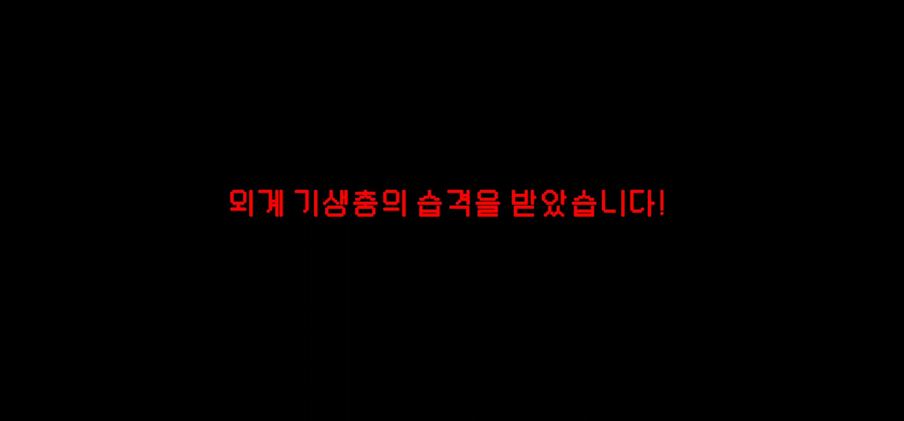<br>

- 기생충과 접촉하면 노동을 할 수 없습니다.
- 기생충과 접촉하면 검은 화면으로 전환됩니다.

## 🏆 게임 승리

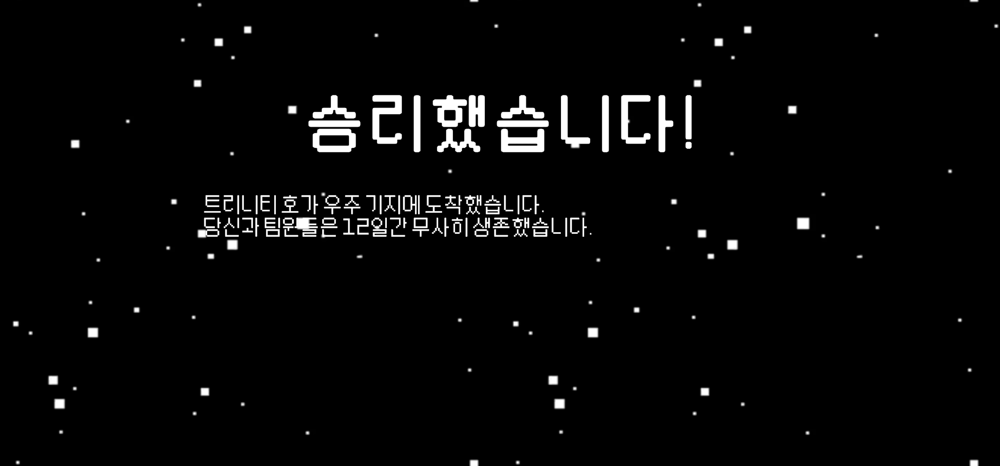<br>

## 😮‍💨 게임 패배

- 게임 패배 유형과 조건은 다음과 같습니다.

### 식량 부족 패배

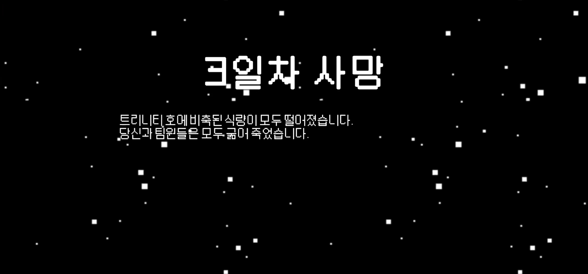<br>

- 비료의 양이 4 미만이라 식량 생산을 못하고 패배
- 중앙 정원이 고장난 상태가 지속되어 식량 생산을 하지 못해 패배
  <br>

### 산소 부족 패배

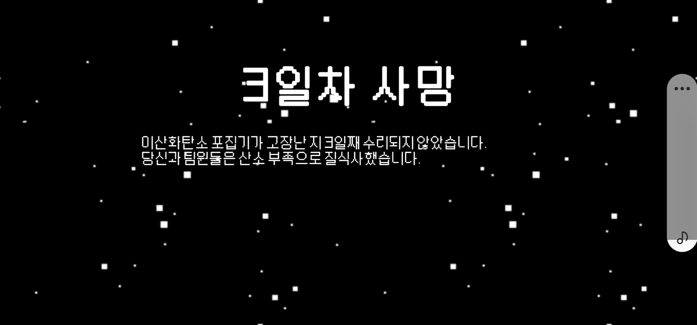<br>

- 이산화탄소 포집기 고장 후 3일동안 수리하지 않아 패배
  <br>

### 정수 부족 패배

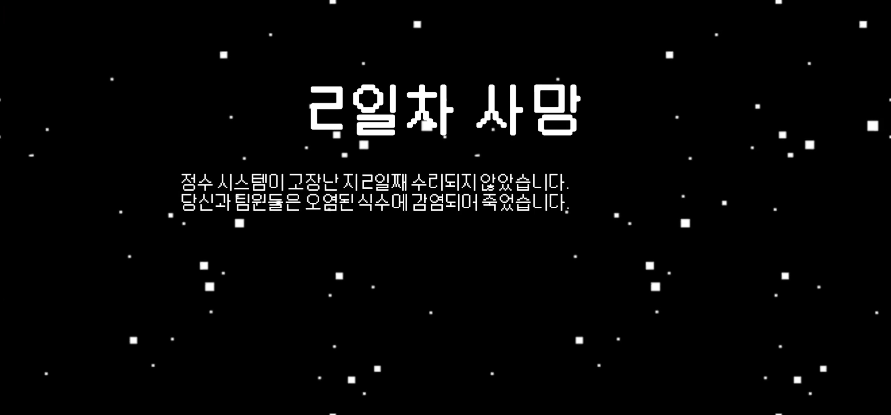<br>

- 정수 시스템 고장 후 2일동안 수리하지 않아 패배

### 연결 해제로 인한 게임 종료

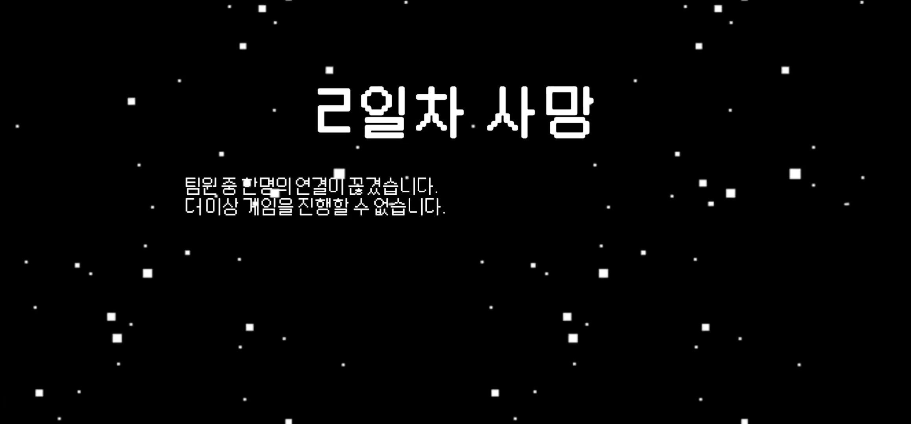<br>

- 팀원 중 한명이라도 연결이 해제되면 게임이 종료됩니다.
