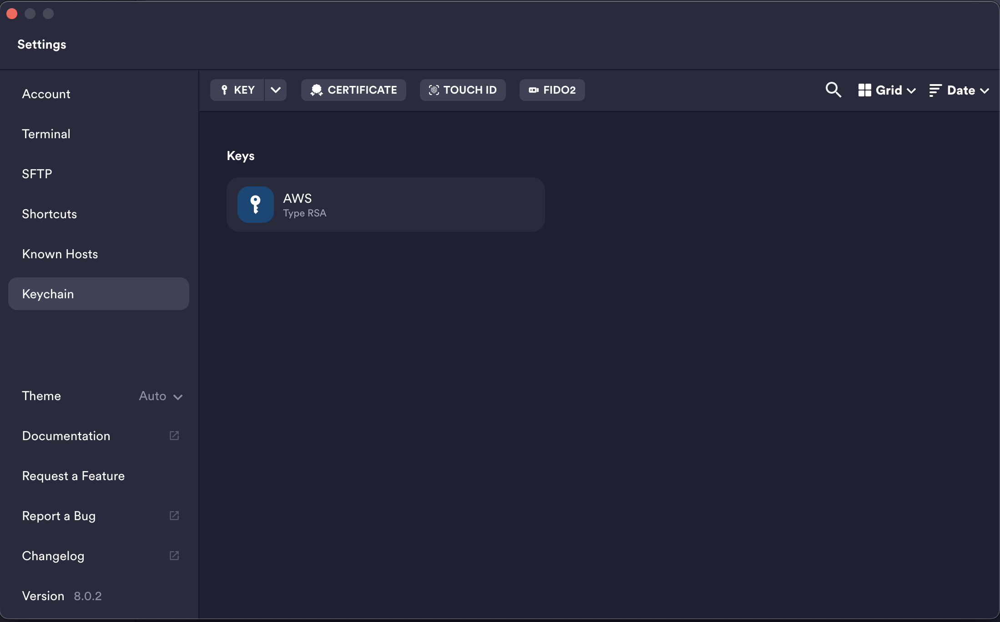
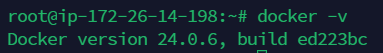
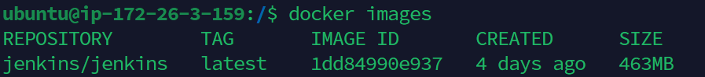

# 포팅메뉴얼

# Index

1. **EC2 서버**
2. **SSL 인증서 발급**
3. **Docker & Docker Compose**
4. **Jenkins**
5. **Gitlab Webhook**
6. **Nginx**
7. **Redis**
8. **SpringBoot 배포**
9. **Jenkins & WebHook 자동배포**

# Setting Info

<aside>
⚙ **JAVA**

- openjdk version "11.0.19" 2023-04-18 LTS

**SpringBoot**

- 2.7.17

**Nginx**

- 1.18.0 (Ubuntu)

**Docker**

- 24.0.7

**Redis**

- 7.2.2
</aside>

# EC2 서버 접속

## EC2 접속을 위한 Termius 설치 및 설정

[Free SSH client for Windows](https://termius.com/free-ssh-client-for-windows)

### **순서**

⇒ key chain에 지급받은 pem 키 등록

⇒ HOST 생성

⇒ 서버 접속

### key chain에 pem키 등록



- key를 추가하기 위해서 `**drag drop**` 또는 `**import key file**`을 통해 pem key 가져오기


- 라벨에 key에 대한 이름 설정 후 저장


### New Host 생성

- 라벨에 역시 구분할 수 있는 이름 설정
- Address 설정 : domain 주소를 입력
- Username 설정 : 기본적으로 `**ubuntu**`로 설정
- Key 설정 : keychain에서 등록한 key로 설정


- 예시에서 도메인은 SSAFY에서 제공한 도메인 주소 입력
  - 예시) `i9b306.p.ssafy.io`


# SSL 인증서 발급

### letsencrypt 설치

```json
sudo apt-get install letsencrypt
```

```json
apt-get install python3-certbot-nginx
```

### 특정 포트 허용하기

```json
sudo ufw allow 443
sudo ufw allow 80
```

### certbot 실행

```json
sudo certbot --nginx
```

### SSL 인증서 발급받을 정보 입력

```json
Enter email address (used for urgent renewal and security notices) (Enter 'c' to
cancel): 메일 입력
- - - - - - - - - - - - - - - - - - - - - - - - - - - - - - - - - - - - - - - -
Please read the Terms of Service at
https://letsencrypt.org/documents/LE-SA-v1.2-November-15-2017.pdf. You must
agree in order to register with the ACME server at
https://acme-v02.api.letsencrypt.org/directory
- - - - - - - - - - - - - - - - - - - - - - - - - - - - - - - - - - - - - - - -
(A)gree/(C)ancel: A

- - - - - - - - - - - - - - - - - - - - - - - - - - - - - - - - - - - - - - - -
Would you be willing to share your email address with the Electronic Frontier
Foundation, a founding partner of the Let's Encrypt project and the non-profit
organization that develops Certbot? We'd like to send you email about our work
encrypting the web, EFF news, campaigns, and ways to support digital freedom.
- - - - - - - - - - - - - - - - - - - - - - - - - - - - - - - - - - - - - - - -
(Y)es/(N)o: Y

Which names would you like to activate HTTPS for?
- - - - - - - - - - - - - - - - - - - - - - - - - - - - - - - - - - - - - - - -
1: https 적용시키고 싶은 도메인 주소
- - - - - - - - - - - - - - - - - - - - - - - - - - - - - - - - - - - - - - - -
Select the appropriate numbers separated by commas and/or spaces, or leave input
blank to select all options shown (Enter 'c' to cancel):
Obtaining a new certificate
Performing the following challenges:
http-01 challenge for admin.flumeride.com
Waiting for verification...
Cleaning up challenges
Deploying Certificate to VirtualHost /etc/nginx/sites-enabled/default

Please choose whether or not to redirect HTTP traffic to HTTPS, removing HTTP access.
- - - - - - - - - - - - - - - - - - - - - - - - - - - - - - - - - - - - - - - -
1: No redirect - Make no further changes to the webserver configuration.
2: Redirect - Make all requests redirect to secure HTTPS access. Choose this for
new sites, or if you're confident your site works on HTTPS. You can undo this
change by editing your web server's configuration.
- - - - - - - - - - - - - - - - - - - - - - - - - - - - - - - - - - - - - - - -
Select the appropriate number [1-2] then [enter] (press 'c' to cancel): 2
Redirecting all traffic on port 80 to ssl in /etc/nginx/sites-enabled/default
```

### 완료 후 도메인 접속해서 테스트

```json
https://도메인주소
```

### 인증 키 위치

```json
cd /etc/letsencrypt/live/<도메인주소>
```

# Docker & Docker Compose

### 레포지토리 set up

```bash
sudo apt-get update
```

### 인증서 관련 패키지 설치

```bash
sudo apt-get install ca-certificates curl gnupg
```

### docker repository 접근을 위한 gpg 키 설정

```bash
sudo install -m 0755 -d /etc/apt/keyrings

curl -fsSL https://download.docker.com/linux/ubuntu/gpg | sudo gpg --dearmor -o /etc/apt/keyrings/docker.gpg

sudo chmod a+r /etc/apt/keyrings/docker.gpg
```

### docker repository 등록

```bash
echo \
  "deb [arch="$(dpkg --print-architecture)" signed-by=/etc/apt/keyrings/docker.gpg] https://download.docker.com/linux/ubuntu \
  "$(. /etc/os-release && echo "$VERSION_CODENAME")" stable" | \
  sudo tee /etc/apt/sources.list.d/docker.list > /dev/null
```

### 패키지 업데이트

```bash
sudo apt-get update
```

### Docker, Docker-compose Install

```bash

sudo apt-get install docker-ce docker-ce-cli containerd.io docker-buildx-plugin docker-compose-plugin
```

### 설치 확인

```bash
docker -v
```



# Jenkins

### Docker Hub에서 Jenkins pull

- pull 이후 image가 생성된 것을 확인

```bash
docker pull jenkins/jenkins
```



### Jenkins container 생성을 위한 docker-compose.yml 파일 설정

```bash
# ~ 경로에서 설정 파일 생성
$ sudo vim docker-compose.yml
```


```bash
jenkins:
        image: jenkins/jenkins:lts
        container_name: jenkins
        volumes:
            - /var/run/docker.sock:/var/run/docker.sock
            - /jenkins:/var/jenkins_home
        ports:
            - "9090:8080"
        user: root
```

### jenkins container 생성 및 실행 확인

```bash
# 도커 컨테이너 생성
# -d 옵션: 백그라운드로 실행시키기 위함
# detach 모드 => 백그라운드 실행 모드
$ sudo docker-compose up -d

# 정상적으로 jenkins container가 실행 되고 있는지 확인
$ sudo docker ps
# 정상적으로 실행 되고 있지 않다면 해당 container가 어떤 상태인지 확인
$ sudo docker ps -a
```


### Jenkins 컨테이너 접속

```bash
docker exec -it jenkins /bin/bash
```

- **`exec`**: 실행 중인 컨테이너에서 명령어를 실행하는 명령어
- **`-it`**: "interactive"와 "tty"의 옵션을 동시에 사용한 것으로, 터미널과 상호 작용할 수 있도록 컨테이너와 상호 연결하고, 터미널 입력을 가능하게 합니다.
- **`/bin/bash`**: 컨테이너 내부에서 실행할 명령어로, 이 경우 "/bin/bash"를 실행하여 shell 세션을 시작

- 컨테이너 터미널에 접속하여 비밀번호 확인하기
- Jenkins 초기 로그인 시 사용

```bash
# 컨테이너 터미널 접속
$ docker exec -it /bin/bash

# 비밀번호 보기
$ cat /var/jenkins_home/secrets/initialAdminPassword
```

### Jenkins 접속

```bash
http://<도메인 주소>:9090
```

- 9090은 compose.yml에서 설정해둔 포트로 접속

### Jenkins 접속 후 설정


- 컨테이너에서 확인한 비밀번호 입력


- Install suggested plugins 선택하면 플러그인 자동 다운로드 수행
- 추후에도 원하는 플러그인 설치 가능


- Jenkins Id, Pw 어려운 걸로 설정하는 것을 권장


- 기본 설정된 URL 을 변경하는 것을 권장(해당 프로젝트는 9090으로 진행)


### Jenkins Credential 설정

- Jenkins 관리 > Security > Credentials
- “Stores scoped to Jenkins”의 global 클릭해서 새로운 인증 정보 생성
- 요구되는 정보 입력 후 `**create`\*\*


- kind : Username with password
- Username : ⭐️⭐️GitLab 사용중인 아이디 (중요)⭐️⭐️
- Password : GitLab 에서 발급받은 토큰 값
- ID : 아무거나 이름짓기

### Jenkins 프로젝트 생성


- new item 으로 프로젝트 생성
- 프로젝트명 입력 후 pipeline 옵션 선택


- Build when a change is pushed to GitLab. GitLab webhook URL: Webhook 을 수행할 깃랩 선택
- Secret Token 발급
  - 여기서 제공되는 URL과 Token은 Gitlab Webhook 걸 때 사용되므로 복사해두기


- **`Definition`**
  - Pipeline script from SCM : 프로젝트 내부에 파일을 생성하여 script 작성하는 방식
  - Pipeline script : jenkins 프로젝트에 직접 script 작성하는 방식
- **`Repository URL`** : 자동배포를 수행할 gitlab 주소
- **`Credentials`** : repsitory URL에 설정한 git에 권한이 있는 사용자
- **`Branch Specifier (blank for 'any')`** : 배포 대상 브랜치
- **`Script Path`** : Jenkinsfile 경로

# GitLab Webhook

- Jenkins가 코드 변화를 감지하여 build, run 하기 위해 webhook 등록 필요
- GitLab Project Repository > Setting > Webhooks
- Jenkins Project URL은 Jenkins 프로젝트 구성에서 Build Triggers에 있음
- 요구되는 정보 입력 후 “200” or “webhook was created” 응답이면 성공


# Nginx

### Nginx 설정 파일

- nginx.conf 파일을 건드리기보다는 새로운 conf 파일 생성하여 진행

```
sudo vi /etc/nginx/sites-available/ask.conf
```

```
server {
    listen 80;
    server_name <도메인주소>;
    return 301 https://<도메인주소>$request_uri;
}

server {
    listen 443 ssl http2;
    server_name <도메인주소>;

		# 로그 설정
    access_log /var/log/nginx/access.log main;

    ssl_certificate /etc/letsencrypt/live/<도메인주소>/fullchain.pem;
    ssl_certificate_key /etc/letsencrypt/live/<도메인주소>/privkey.pem;

    location /api/ {
        proxy_pass http://<도메인주소>;
        proxy_redirect off;
        charset utf-8;

        proxy_http_version 1.1;
        proxy_set_header Connection "upgrade";
        proxy_set_header Upgrade $http_upgrade;
        proxy_set_header Host $http_host;
        proxy_set_header X-Real-IP $remote_addr;
        proxy_set_header X-Forwarded-For $proxy_add_x_forwarded_for;
        proxy_set_header X-Forwarded-Proto $scheme;
        proxy_set_header X-NginX-Proxy true;
    }
}
```

### 설정 파일 저장 후 **sites-enabled에 심볼릭 링크 생성**

- conf 설정 파일을 적용하기 위해 **sites-available** 와 **sites-enabled** 폴더를 연결하는 링크 생성 필요
- 심볼릭 링크**:** 특정 폴더에 링크를 걸어 원본파일을 사용하기 위함

```jsx
sudo ln -s /etc/nginx/sites-available/themint.conf /etc/nginx/sites-enabled
```

### 새로운 설정 적용을 위한 Nginx 재실행

```
sudo systemctl restart nginx

# nginx 상태 확인
sudo systemctl status nginx
```

# Redis

## Redis 도커 이미지 pull & 컨테이너 생성

- redis 2.6 버전 이상부터는 readOnly가 디폴트이기 때문에 설정 변경 필요

```bash
# docker redis 이미지 다운
$ docker pull redis

# 도커 이미지 생성
$ docker-compose.yml
```

```bash
# docker-compose.yml 파일 내용

# 파일 규격 버전
version: '3'

# 실행하려는 컨테이너들 정의
services:
  # 서비스명
	redis:
    image: redis:latest
    container_name: redis
    ports:
      - "6379:6379"
    volumes:
      - ./redis/data:/data
      - ./redis/conf/redis.conf:/usr/local/conf/redis.conf
    restart: always
    command: redis-server /usr/local/conf/redis.conf --requirepass ASKadmin308.
```

```bash
# docker-compose로 컨테이너 생성 및 실행
$ docker-compose up -d
```


## 설정한 Redis 비밀번호 확인

```bash
# redis 컨테이너 접속
docker exec -it 컨테이너명 bash

# redis redis-cli 접속
redis-cli

# conf에서 비밀번호 설정안했다면 수행할 것
CONFIG SET requirepass 설정하고자하는 비밀번호

# 비밀번호 설정 확인
# OK 뜨면 성공
auth 설정한 비밀번호

# 설정 저장
save
```

# SpringBoot 배포

### Dockerfile 생성


```bash
FROM openjdk:11-jdk
ARG JAR_FILE=build/libs/*.jar
COPY ${JAR_FILE} app.jar
ENTRYPOINT ["java","-jar","app.jar"]
```

### application.yml 볼륨 설정

- Jenkins 혹은 Springboot 컨테이너가 새로 빌드 될 때 application.yml 파일이 초기화되어 사라지기 때문에 수동으로 넣어줘야하는 번거로움을 해결하기 위한 마운트 설정
- Jenkins 컨테이너가 동작하고 있는 **`호스트 서버`**에의 해당 경로에서 application.yml 생성
  
- 원하는 경로 생성 후 application.yml 생성

```bash
version: '3'

services:
  jenkins:
    image: jenkins/jenkins:lts
    container_name: jenkins
    volumes:
      - /var/run/docker.sock:/var/run/docker.sock
      - /jenkins:/var/jenkins_home
    ports:
      - "9090:8080"
    user: root
```

```bash
<마운트 할 파일 경로와 파일명>:<마운트 수행할 위치>
ex) /var/jenkins_home/resources/application.yml:/var/jenkins_home/workspace/Springboot/trinity/src/main/resources/application.yml
```

- <출발지:호스트 경로>:<목적지:컨테이너 내부 경로>
- /jenkins:/var/jenkins_home : 호스트에서 Jenkins 컨테이너로 application.yml을 마운트 설정
- jenkins container가 생성될 때 자동으로 마운트를 수행할 수 있도록 volumes 설정

### Jenkinsfile 생성

```bash
pipeline {
    agent any

    stages {
        stage('Springboot build') {
            steps {
                dir('trinity'){
                    sh '''
                    pwd
                    echo 'springboot build'

                    #!/bin/bash

                    # Source and destination directories (jenkins 내부 -> jenkins 내부로)
                    SRC_DIR="/var/jenkins_home/resources/springboot1"
                    DEST_DIR="/var/jenkins_home/workspace/Springboot/trinity/src/main/resources"

                    # File to copy
                    FILE="application.yml"

                    # Check if destination directory exists, if not create it
                    if [ ! -d "$DEST_DIR" ]; then
                        mkdir -p "$DEST_DIR"
                    fi

                    # Copy the file
                    cp "$SRC_DIR/$FILE" "$DEST_DIR/$FILE"

                    chmod +x gradlew
                    ./gradlew clean build
                    '''
                }
            }
            post {
                success {
                    sh 'echo "Successfully built SpringBoot "'
                }
                failure {
                    sh 'echo "Failed to build SpringBoot"'
                }
            }
        }

        stage('Docker image build') {
            steps {
                dir('trinity'){
                    sh '''
                    echo 'Docker image build'
                    docker build -t docker-springboot1:0.0.1 .
                    '''
                }
            }
            post {
                success {
                    sh 'echo "Successfully built Docker image "'
                }
                failure {
                    sh 'echo "Failed to build Docker image "'
                }
            }
        }

        stage('Deploy') {
            steps {
                dir('trinity'){
                    sh '''
                    echo 'Deploy'

                    docker stop springboot
                    docker rm springboot

                    docker run -d -p 8080:8080 -p 8587:8587 --name springboot docker-springboot1:0.0.1

                    '''
                }
            }
            post {
                success {
                    sh 'echo "Successfully deployed "'
                }
                failure {
                    sh 'echo "Failed to deploy"'
                }
            }
        }
    }
}
```

### 빌드 성공 시 화면


